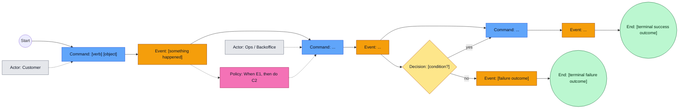
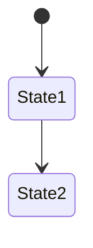
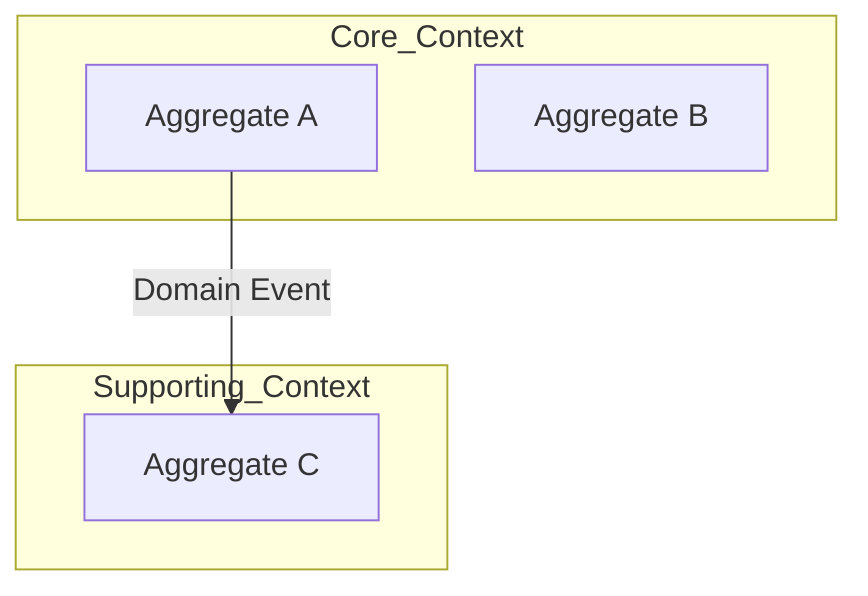

# DDD Discovery Session: [Domain Name]
**Date:** [Date]
**Participants:** [Names]
**Facilitator:** [Name]
**Business Outcome:** [One sentence description]

## Orientation (Read Aloud at Start, or When Asked)
We’re doing a **Domain-Driven Design (DDD) analysis** of a business area / set of processes.

- **You (human) are the SME:** you know the real workflow, exceptions, rules, and language.
- **I (agent) am the facilitator:** I’ll guide a structured session to capture the language precisely, map the end-to-end flow, and make rules/decisions explicit so we can model it clearly.

If DDD terms are unfamiliar, I’ll define them briefly the first time we use them and tie them back to your wording.

Quick glossary (use as needed):
- **Command:** an intention to do something (can fail) - a verb + object phrase
- **Domain event:** a fact that happened after a command succeeds - always in past tense
- **Policy:** “when X happens, we do Y” (an automated reaction)
- **Invariant:** a rule that must always hold; if it fails, the command is rejected

## Session Rules
- One question at a time
- Use SME language first; model terms second
- No passive voice (“the system does…”)
- Every event must have a clear trigger (actor + command)
- Stop and rephrase vague statements
- If it can’t be named precisely, it isn’t understood yet

**Scope / In Scope:**
- 

**Non-Goals / Out of Scope (for now):**
- 

**Assumptions (validate later):**
- 

## Diagram Conventions (Mermaid)
- Event timelines: `flowchart LR`
- Commands always left of events
- Policies always dashed edges
- Aggregates/contexts grouped using `subgraph`

---

## PHASE 1: Event Catalogue + Narrative (Happy Path First)

This template is designed to be built **incrementally**. Start with the smallest coherent happy path (key commands + key events), then iterate by asking probing questions to add unhappy paths, decisions, policies, and deeper detail.

**Working agreement:** keep the Mermaid diagram(s) and the tables continuously up to date. If you stop at any moment, this document should reflect the best current understanding of the domain and exactly how far the analysis has progressed.

### The Story
[SME describes the process in their words]

**Incremental facilitation loop (use throughout the session):**
- Capture 3–7 “spine” steps first (happy path only): the smallest sequence that reaches a terminal success outcome.
- Expand the Event Catalogue with precise SME wording + meaning as each event appears.
- Add the matching commands to the canonical diagram (keep one time axis) and fill the Commands → Events table.
- Ask probing questions to grow detail:
  - “What can go wrong here?” (unhappy paths)
  - “How do we decide?” (decisions/branches)
  - “What happens automatically after this?” (policies)
  - “What must always be true?” (rules/invariants)
- Repeat until the SME says the narrative is complete enough for the session.

### Event Catalogue (Chronological)

Purpose: capture *what happens* in SME language (names + meaning) without worrying yet about commands/policies/layout. This is the single source of truth for event names; the canonical diagram below is the executable narrative (command↔event spine + branches).

| Event Name (SME wording) | Model Event Name | When it happens | Trigger (Actor / Command) | Notes / Meaning |
|--------------------------|------------------|-----------------|---------------------------|----------------|
|                          |                  |                 |                           |                |

## Event Storm – End-to-End (Living Diagram)  ✅ CANONICAL

This is the *primary* narrative artefact for the session. It must read strictly left-to-right as a single time axis.

**Hard rules (non-negotiable):**
- Use `flowchart LR`.
- The happy-path MUST be a single chained sequence on one horizontal timeline, alternating between commands and events (start with whichever makes sense for the scenario):
  `Start → Command → Event → Command → Event → … → End`.
- Commands MUST be connected to the previous event (or start node) so they appear **in sequence**, not stacked.
- Actors MUST NOT form their own “vertical” command list:
  - Show actor responsibility via **dashed** links to commands, *off the time axis*.
- Decisions (branches) MUST sit on the time axis and branch from an event.
- Add unhappy paths as branches off the relevant event/decision, but keep the main spine intact.
- Anti-pattern to avoid: multiple commands pointing from an actor without being chained from prior events (this implies simultaneity).

Use the Event Catalogue above to keep event naming consistent (SME wording ↔ model name) as you evolve this diagram.

### Commands → Events (Initial)
| Command | Actor | Produces Event(s) | Notes / Preconditions |
|--------|-------|-------------------|-----------------------|
|        |       |                   |                       |

---

## PHASE 2: Event Deep Dive

### [EventName]
- **Command:** 
- **Actor:** 
- **Business Rules:**
  - 
- **Data Required:**
  - 
- **Downstream Events:**
  - 
- **Alternative Flows:**
  - 

### Context Tension Check (after the 2–3 most important events)
Answer explicitly:
- Would another team disagree with the meaning of this event?
- Is this rule driven by regulatory, operational, or commercial reasons?
- Would we want to deploy this logic independently?

If “yes” to any, capture the emerging boundary here:
- Candidate context boundary:
- Source of tension:
- Terms that differ by context:

### Business Rules / Invariants (Catalog)
| Rule ID | Statement (must always be true) | Example (Given/When/Then) | Enforced By (candidate) |
|--------|----------------------------------|----------------------------|--------------------------|
| R1     |                                  |                            |                          |

---

## PHASE 3: Aggregates

### Aggregate Summary
| Aggregate | Responsibility | Commands | Key Invariants |
|----------|----------------|----------|----------------|
|          |                |          |                |

### [AggregateName]
**Responsibility:** [What does this protect/enforce?]

**Why this is an aggregate (mandatory):**
- Lifecycle:
- Invariants enforced:
- Must change atomically because:
- What would break if split?

**Commands Handled:**
- 
**Events Emitted:**
- 
**Invariants:**
- 
**State Owned (authoritative):**
- 

**Lifecycle (optional):**

---

## Architecture Signals

### Consistency & Transactions
- Strong consistency required within:
- Eventual consistency across:

### State & Storage Implications
- Event-sourced candidates:
- CRUD/persistence-oriented components:
- Temporal/audit requirements:

### Coupling Risks
- High fan-out events:
- Chatty aggregates:
- Cross-context invariants (smell):

### Quality Attributes & Constraints
- Latency/throughput expectations:
- Availability/consistency trade-offs:
- Security/privacy/PII constraints:
- Observability needs (logs/metrics/traces/audit):

---

## PHASE 4: Supporting Patterns

### Read Models
| Name | Purpose | Source Events | Consistency / Freshness |
|------|---------|--------------|--------------------------|

|      |         |             |                         |

### Policies (Event → Command)
| When (Event) | Then (Command) | Why |
|--------------|----------------|-----|

|              |                |     |

### Sagas / Process Managers
| Name | Trigger | Responsibilities | Completion Signal |
|------|---------|------------------|-------------------|
|      |         |                  |                   |

### External Systems
| System | Integration Point | Events In | Events Out |
|--------|-------------------|----------|-----------|

|        |                  |          |           |

---

## Bounded Context Map

---

## Ubiquitous Language

| Term (SME wording) | Model Term | Definition | Used By |
|-------------------|------------|------------|---------|
|                   |            |            |         |

Rule: every domain event name must map back to SME wording. If renamed, record both.

---

## Open Questions / Parking Lot
-

---

## Key Decisions (Session ADRs)
| Decision | Context | Chosen Option | Rejected Options | Reason |
|----------|---------|---------------|------------------|--------|
|          |         |               |                  |        |

---

## Explicit Non-Goals / Out of Scope
- Concepts intentionally NOT modelled:
- Processes owned elsewhere:
- Data we will consume but not own:

---

## Decisions / Follow-ups
| Item | Decision or Action | Owner | Due |
|------|--------------------|-------|-----|
|      |                    |       |     |

---

## Facilitator Notes (optional, not shared)
- Aggregate smells noticed:
- Language conflicts:
- Follow-up sessions required: