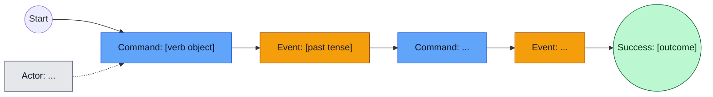
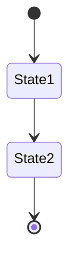
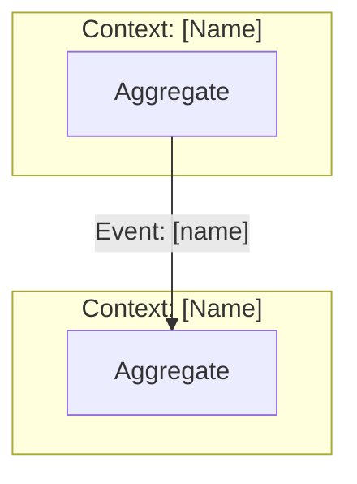

# DDD Discovery Session: [Domain Name]

| Field | Value |
|-------|-------|
| **Date** | [Date] |
| **SME** | [Name] |
| **Facilitator** | [Agent/Name] |
| **Business Outcome** | [One sentence: what does success look like?] |
| **Session Mode** | [ ] From scratch / [ ] From skeleton |

---

## Orientation

> **Read aloud or paraphrase at session start:**
>
> We're doing a Domain-Driven Design analysis of your business process.
>
> - **You** are the Subject Matter Expert — you know how it actually works, the language, rules, and exceptions.
> - **I** am the facilitator — I'll guide us through a structured discovery to capture the workflow precisely.
>
> We'll work in phases: first the happy path (everything goes right), then we'll dig into rules, failures, and structure.
>
> I'll ask one question at a time. If I use unfamiliar terms, I'll define them. If something's vague, I'll push for precision.

### Quick Glossary (reference as needed)
| Term | Meaning |
|------|---------|
| **Command** | An intention to do something (can fail) — verb + object |
| **Domain Event** | A fact that happened — always past tense |
| **Policy** | "When X happens, do Y" — an automated reaction |
| **Invariant** | A rule that must always hold |

---

## Scope

**In Scope:**
-

**Out of Scope (for this session):**
-

**Assumptions (to validate):**
-

---

## Session Mode

### [ ] Option A: From Scratch
SME describes the process; facilitator captures.

### [ ] Option B: From Skeleton
Facilitator proposes a typical flow; SME reacts, corrects, customizes.

**If skeleton mode:** Facilitator drafts initial diagram below, then asks: "What's wrong, missing, or named differently?"

---

## PHASE 1: Happy Path (End-to-End)

**Goal:** Capture the successful path from trigger to outcome. No exceptions yet.

### The Trigger
| Element | Value |
|---------|-------|
| **Actor** | [Who/what starts it?] |
| **Command/Event** | [What kicks it off?] |
| **Success Outcome** | [What does "done successfully" look like?] |

### Event Catalogue

Source of truth for event names and meanings.

| # | Event (SME wording) | Model Name | When it happens | Triggered by | Notes |
|---|---------------------|------------|-----------------|--------------|-------|
| 1 | | | | | |
| 2 | | | | | |
| 3 | | | | | |

### Commands → Events

| Command | Actor | Produces Event | Preconditions |
|---------|-------|----------------|---------------|
| | | | |

### End-to-End Event Storm (Canonical Diagram)

**Rules:**
- Single horizontal spine: Start → Command → Event → ... → Success End
- Actors connect via dashed lines (off-spine)
- No unhappy paths until Phase 2



### Edge Cases / Exceptions (Parked)

Captured during Phase 1, explored in Phase 2.

| # | Exception | Mentioned at | Priority |
|---|-----------|--------------|----------|
| 1 | | | |

### Phase 1 Exit Checklist
- [ ] Trigger identified (actor + command)
- [ ] Success end state explicit in diagram
- [ ] Event Catalogue has 5-15 events
- [ ] Diagram shows unbroken happy-path spine
- [ ] SME confirms: "That's the successful case"

---

## PHASE 2: Deep Dive

**Goal:** Add depth — rules, data, decisions, failures.

**Prerequisite:** Phase 1 checklist complete.

### Event Deep Dives

#### [Event Name 1]
| Aspect | Detail |
|--------|--------|
| **Command** | |
| **Actor** | |
| **Business Rules** | |
| **Data Required** | |
| **What can go wrong?** | |

#### [Event Name 2]
| Aspect | Detail |
|--------|--------|
| **Command** | |
| **Actor** | |
| **Business Rules** | |
| **Data Required** | |
| **What can go wrong?** | |

### Business Rules / Invariants

| ID | Rule (must always be true) | Example | Enforced by |
|----|---------------------------|---------|-------------|
| R1 | | | |

### Unhappy Paths (Top 3)

Now we model the parked exceptions.

| # | Failure Scenario | Branches from | Terminal Outcome |
|---|------------------|---------------|------------------|
| 1 | | | |
| 2 | | | |
| 3 | | | |

Update the canonical diagram with decision branches:

```mermaid
flowchart LR
  classDef command fill:#60a5fa,stroke:#1d4ed8,color:#0b1220
  classDef event fill:#f59e0b,stroke:#92400e,color:#111827
  classDef decision fill:#fde68a,stroke:#b45309,color:#111827
  classDef terminal fill:#bbf7d0,stroke:#166534,color:#052e16
  classDef failure fill:#fecaca,stroke:#b91c1c,color:#450a0a

  %% Copy happy path from Phase 1, then add branches

  %% Example decision branch:
  %% E2 --> D1{"Rule check?"}:::decision
  %% D1 -->|pass| C3
  %% D1 -->|fail| EF1["Event: [failure]"]:::event --> TF1(("Failure: [outcome]")):::failure
```

### Context Tension Check

Answer after examining 2-3 key events:

| Question | Answer | Implication |
|----------|--------|-------------|
| Would another team define this event differently? | | |
| Is this rule regulatory, operational, or commercial? | | |
| Would you deploy this logic independently? | | |

**Candidate context boundary (if detected):**
- Boundary name:
- Source of tension:
- Terms that differ:

### Phase 2 Exit Checklist
- [ ] Key events have business rules documented
- [ ] Top 3 failures modeled with terminal outcomes
- [ ] Data requirements identified
- [ ] Context tensions noted (or "none detected")

---

## PHASE 3: Aggregates

**Goal:** Find consistency boundaries.

**Prerequisite:** Phase 2 checklist complete.

### Aggregate Candidates

| Aggregate | Responsibility | Commands | Events | Key Invariants |
|-----------|---------------|----------|--------|----------------|
| | | | | |

### Aggregate Detail: [Name]

| Aspect | Detail |
|--------|--------|
| **Responsibility** | What does this protect/enforce? |
| **Commands handled** | |
| **Events emitted** | |
| **Invariants** | |
| **State owned** | |

**Why this is an aggregate:**
- Must change atomically because:
- What would break if split:

**Lifecycle (if useful):**


### Phase 3 Exit Checklist
- [ ] Aggregate candidates identified
- [ ] Each has: commands, events, invariants
- [ ] Consistency boundaries justified

---

## PHASE 4: Supporting Patterns

**Goal:** Read models, policies, sagas, external systems.

**Prerequisite:** Phase 3 checklist complete.

### Read Models (Queries)

| Query Name | User | Purpose | Source Events | Freshness |
|------------|------|---------|---------------|-----------|
| | | | | |

### Policies (Automated Reactions)

| When (Event) | Then (Command) | Why |
|--------------|----------------|-----|
| | | |

### Sagas / Process Managers

| Name | Trigger | Steps | Completion Signal |
|------|---------|-------|-------------------|
| | | | |

### External Systems

| System | Integration Point | Events In | Events Out |
|--------|-------------------|-----------|------------|
| | | | |

### Phase 4 Exit Checklist
- [ ] Key read models identified
- [ ] Policies captured
- [ ] Long-running processes noted
- [ ] External boundaries mapped

---

## Bounded Context Map



---

## Ubiquitous Language

| Term (SME wording) | Model Term | Definition | Context |
|-------------------|------------|------------|---------|
| | | | |

**Rule:** Every domain event name must trace to SME wording. If renamed, record both.

---

## Open Questions / Parking Lot

| # | Question | Raised during | Status |
|---|----------|---------------|--------|
| 1 | | | |

---

## Key Decisions

| Decision | Options Considered | Chosen | Reason |
|----------|-------------------|--------|--------|
| | | | |

---

## Session Summary

**What we covered:**
-

**What's still open:**
-

**Recommended next steps:**
-

---

## Facilitator Notes (not shared)

- Aggregate smells:
- Language conflicts:
- Follow-up sessions needed:
