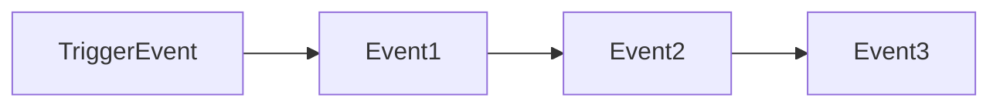
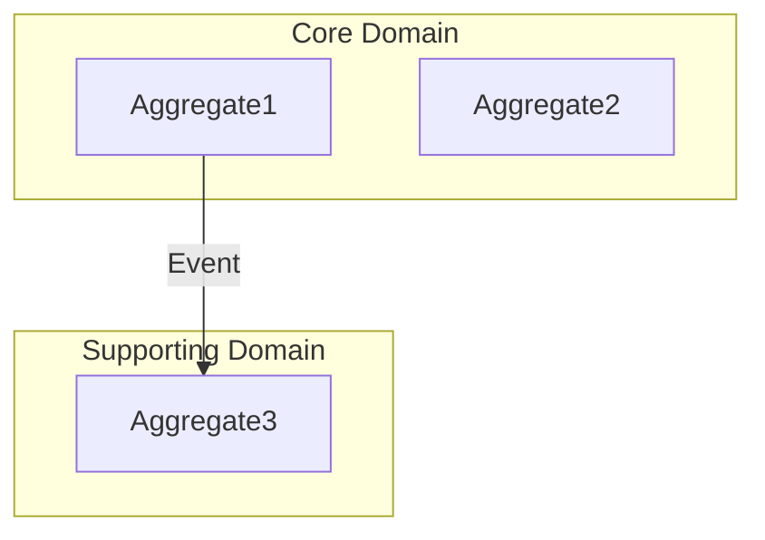

# DDD Discovery Session: [Domain Name]
**Date:** [Date]
**Participants:** [Names]
**Business Outcome:** [One sentence description]

---

## PHASE 1: Happy Path Event Timeline

### The Story
[SME describes the process in their words]

### Domain Events (Chronological)

| Event Name | When it happens | Who/What triggered it |
|------------|----------------|----------------------|
|            |                |                      |

---

## PHASE 2: Event Deep Dive

### [EventName]
- **Command:** 
- **Actor:** 
- **Business Rules:**
  - 
- **Data Required:**
  - 
- **Downstream Events:**
  - 
- **Alternative Flows:**
  - 

---

## PHASE 3: Aggregates

### [AggregateName]
**Responsibility:** [What does this protect/enforce?]

**Commands Handled:**
- 
**Events Emitted:**
- 
**Invariants:**
- 
**State:**
- 

---

## PHASE 4: Supporting Patterns

### Read Models
| Name | Purpose | Data Sources |
|------|---------|-------------|

### Policies (Event → Command)
| When (Event) | Then (Command) | Why |
|--------------|----------------|-----|

### External Systems
| System | Integration Point | Events In/Out |
|--------|------------------|---------------|

---

## Bounded Context

---

## Ubiquitous Language

| Term | Definition | Used By |
|------|------------|---------|
|      |            |         |

---

## Open Questions / Parking Lot
-