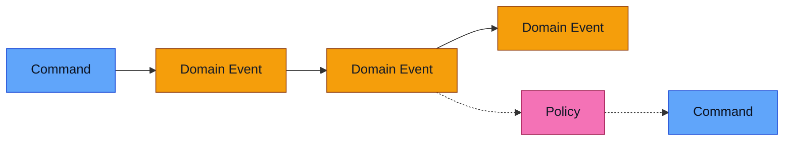
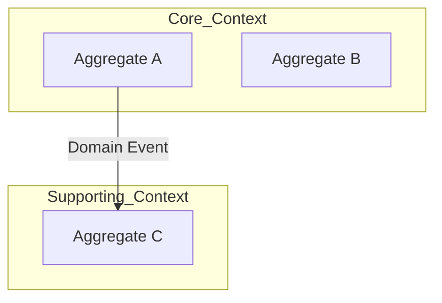

# DDD Discovery Session: [Domain Name]
**Date:** [Date]
**Participants:** [Names]
**Facilitator:** [Name]
**Business Outcome:** [One sentence description]

## Session Rules
- One question at a time
- Use SME language first; model terms second
- No passive voice (“the system does…”)
- Every event must have a clear trigger (actor + command)
- Stop and rephrase vague statements
- If it can’t be named precisely, it isn’t understood yet

**Scope / In Scope:**
- 

**Non-Goals / Out of Scope (for now):**
- 

**Assumptions (validate later):**
- 

## Diagram Conventions (Mermaid)
- Event timelines: `flowchart LR`
- Commands always left of events
- Policies always dashed edges
- Aggregates/contexts grouped using `subgraph`

---

## PHASE 1: Happy Path Event Timeline

### The Story
[SME describes the process in their words]

### Domain Events (Chronological)


## Event Storm – End-to-End (Living Diagram)  ✅ CANONICAL

This is the *primary* narrative artefact for the session. It must read strictly left-to-right as a single time axis.

**Hard rules (non-negotiable):**
- Use `flowchart LR`.
- The happy-path MUST be a single chained sequence:
  `Command → Event → Command → Event → …` (one horizontal timeline).
- Commands MUST be connected to the previous event (or start node) so they appear **in sequence**, not stacked.
- Actors MUST NOT form their own “vertical” command list:
  - Show actor responsibility via **dashed** links to commands, *off the time axis*.
- Decisions (branches) MUST sit on the time axis and branch from an event.
- Add unhappy paths as branches off the relevant event/decision, but keep the main spine intact.
- Anti-pattern to avoid: multiple commands pointing from an actor without being chained from prior events (this implies simultaneity).

```mermaid
flowchart LR
  %% (maintained incrementally)


| Event Name (SME wording) | Model Event Name | When it happens | Trigger (Actor / Command) |
|--------------------------|------------------|-----------------|---------------------------|
|                      |                  |                 |                           |

### Commands → Events (Initial)
| Command | Actor | Produces Event(s) | Notes / Preconditions |
|--------|-------|-------------------|-----------------------|
|        |       |                   |                       |

---

## PHASE 2: Event Deep Dive

### [EventName]
- **Command:** 
- **Actor:** 
- **Business Rules:**
  - 
- **Data Required:**
  - 
- **Downstream Events:**
  - 
- **Alternative Flows:**
  - 

### Context Tension Check (after the 2–3 most important events)
Answer explicitly:
- Would another team disagree with the meaning of this event?
- Is this rule driven by regulatory, operational, or commercial reasons?
- Would we want to deploy this logic independently?

If “yes” to any, capture the emerging boundary here:
- Candidate context boundary:
- Source of tension:
- Terms that differ by context:

### Business Rules / Invariants (Catalog)
| Rule ID | Statement (must always be true) | Example (Given/When/Then) | Enforced By (candidate) |
|--------|----------------------------------|----------------------------|--------------------------|
| R1     |                                  |                            |                          |

---

## PHASE 3: Aggregates

### Aggregate Summary
| Aggregate | Responsibility | Commands | Key Invariants |
|----------|----------------|----------|----------------|
|          |                |          |                |

### [AggregateName]
**Responsibility:** [What does this protect/enforce?]

**Why this is an aggregate (mandatory):**
- Lifecycle:
- Invariants enforced:
- Must change atomically because:
- What would break if split?

**Commands Handled:**
- 
**Events Emitted:**
- 
**Invariants:**
- 
**State Owned (authoritative):**
- 

**Lifecycle (optional):**
```mermaid
stateDiagram-v2
  [*] --> State1
  State1 --> State2
```

---

## Architecture Signals

### Consistency & Transactions
- Strong consistency required within:
- Eventual consistency across:

### State & Storage Implications
- Event-sourced candidates:
- CRUD/persistence-oriented components:
- Temporal/audit requirements:

### Coupling Risks
- High fan-out events:
- Chatty aggregates:
- Cross-context invariants (smell):

### Quality Attributes & Constraints
- Latency/throughput expectations:
- Availability/consistency trade-offs:
- Security/privacy/PII constraints:
- Observability needs (logs/metrics/traces/audit):

---

## PHASE 4: Supporting Patterns

### Read Models
| Name | Purpose | Source Events | Consistency / Freshness |
|------|---------|--------------|--------------------------|

|      |         |             |                         |

### Policies (Event → Command)
| When (Event) | Then (Command) | Why |
|--------------|----------------|-----|

|              |                |     |

### Sagas / Process Managers
| Name | Trigger | Responsibilities | Completion Signal |
|------|---------|------------------|-------------------|
|      |         |                  |                   |

### External Systems
| System | Integration Point | Events In | Events Out |
|--------|-------------------|----------|-----------|

|        |                  |          |           |

---

## Bounded Context Map


---

## Ubiquitous Language

| Term (SME wording) | Model Term | Definition | Used By |
|-------------------|------------|------------|---------|
|                   |            |            |         |

Rule: every domain event name must map back to SME wording. If renamed, record both.

---

## Open Questions / Parking Lot
-

---

## Key Decisions (Session ADRs)
| Decision | Context | Chosen Option | Rejected Options | Reason |
|----------|---------|---------------|------------------|--------|
|          |         |               |                  |        |

---

## Explicit Non-Goals / Out of Scope
- Concepts intentionally NOT modelled:
- Processes owned elsewhere:
- Data we will consume but not own:

---

## Decisions / Follow-ups
| Item | Decision or Action | Owner | Due |
|------|--------------------|-------|-----|
|      |                    |       |     |

---

## Facilitator Notes (optional, not shared)
- Aggregate smells noticed:
- Language conflicts:
- Follow-up sessions required: